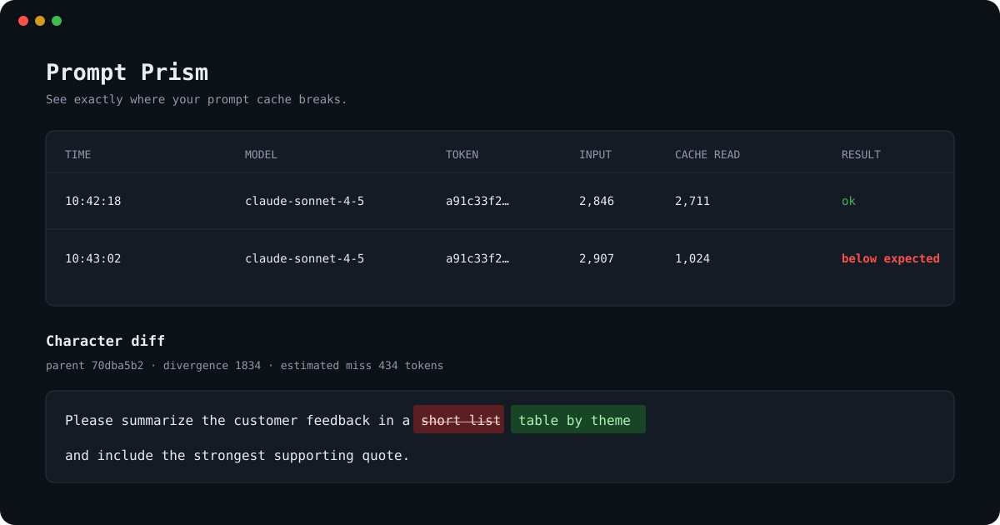

# Prompt Prism

**See exactly where your prompt cache breaks.**

Prompt Prism is a zero-runtime-dependency local proxy for Anthropic's Messages API. It forwards responses immediately—including SSE streams—while capturing a redacted copy in the background and showing exactly where a conversation diverged from its best historical prefix.



```text
your app  ──►  http://127.0.0.1:8787  ──►  api.anthropic.com
                       │
                       └──► capture + character diff + dashboard
```

## Quick start

Requires Node.js 20 or later.

```bash
npm install -g prompt-prism
pp start --upstream-url https://provider.example.com/v1/messages
```

Then set the Anthropic SDK base URL to `http://127.0.0.1:8787`. Keep using your normal API key; authentication headers are forwarded but never stored in plaintext.

```js
import Anthropic from '@anthropic-ai/sdk';

const client = new Anthropic({
  apiKey: process.env.ANTHROPIC_API_KEY,
  baseURL: 'http://127.0.0.1:8787'
});
```

Open [http://127.0.0.1:8787/_pp/](http://127.0.0.1:8787/_pp/) to inspect captures. `pp start` opens it automatically.

The longer `prompt-prism` command is also installed as an alias for `pp`.

## Agent demo

The repository includes a small multi-turn chat Agent for exercising Prompt Prism. The Demo points at local Prism, while Prism alone owns the complete model-provider endpoint URL.

```text
browser chat → Demo Agent (:3000) → Prompt Prism (:8787) → model provider
```

Start Prompt Prism with the complete provider endpoint, then copy the environment template and fill in the credential and model name:

```bash
# Terminal 1
pp start --upstream-url https://api.stepfun.com/step_plan/v1/messages

# Terminal 2
cp .env.example .env
npm run demo
```

Then open the Agent chat at [http://127.0.0.1:3000/](http://127.0.0.1:3000/).

Required variables (see [.env.example](.env.example)):

- `DEMO_MODEL_PROVIDER_TOKEN`: provider credential sent through Prism by the Demo backend.
- `DEMO_AGENT_MODEL`: model selected by the Demo Agent.

`DEMO_BASE_URL` is optional and defaults to `http://127.0.0.1:8787`; do not include `/v1`. Demo appends `/v1/messages`. It identifies Prism, not the real model provider. `DEMO_PORT` is also optional and defaults to `3000`.

For any third-party Anthropic-compatible program, temporarily point its Base URL at Prism:

```bash
ANTHROPIC_BASE_URL=http://127.0.0.1:8787 your-command
```

## CLI

```text
pp start [--upstream-url URL] [--port NUMBER] [--data-dir PATH]
         [--max-storage 1GB] [--open | --no-open]
```

`--upstream-url` is the complete upstream HTTP or HTTPS endpoint, including its final path and optional query string. Prism always sends model traffic to this exact endpoint; it does not append, remove, or rewrite `/v1/messages` based on the client request path.

For example:

```text
Demo → http://127.0.0.1:8787/v1/messages
     → https://api.stepfun.com/step_plan/v1/messages
```

For local development:

```bash
npm link
pp start --upstream-url https://provider.example.com/v1/messages --no-open
npm test
```

## How matching works

Captures are grouped by a one-way SHA-256-derived API-token hash. Within a group, Prompt Prism selects the earlier capture with the most equal complete message objects; ties are broken by the longest serialized character prefix. It then calculates a Myers character diff and compares the prefix length (approximately four characters per token) with Anthropic's `cache_read_input_tokens`.

The token estimate is diagnostic, not billing data: tokenization is model-dependent. The actual cache usage always comes from the provider response.

## Data and privacy

Captures live under `./data` by default. API keys, authorization headers, and cookies are replaced with `[REDACTED]`. Request and response bodies are stored locally because they are required for analysis. The default cap is 1 GB; the oldest capture files and index entries are evicted first.

Use a separate `--data-dir` for sensitive projects, do not commit it, and delete it when the debugging session is finished.

## License

MIT
