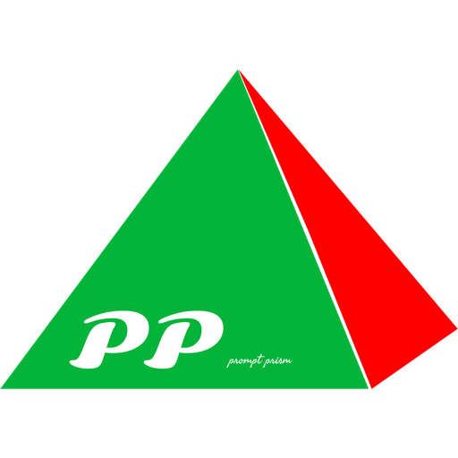
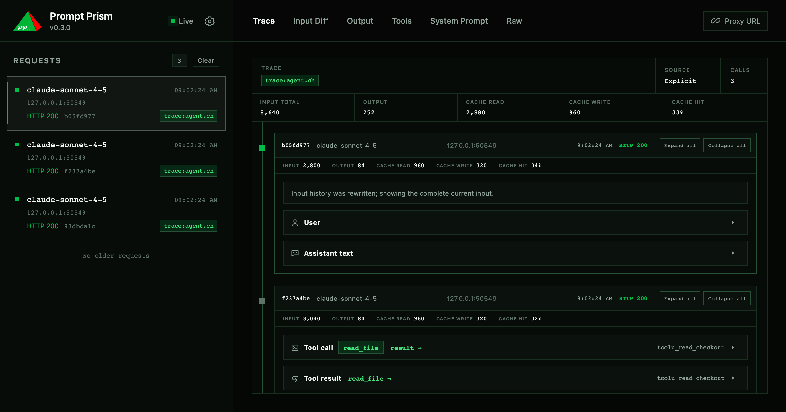

<p align="center">
  
</p>

<h1 align="center">Prompt Prism</h1>

<p align="center"><strong>Inspect exactly what your model receives.</strong></p>

<p align="center">
  A zero-runtime-dependency local proxy for debugging model requests, prompt changes, tool use, and multi-request agent traces.
</p>

<p align="center">
  <a href="https://tao-zhi-1992.github.io/prompt-prism/">Website</a> ·
  <a href="docs/guide.md">Guide</a> ·
  <a href="docs/insights.md">Agent Insights</a> ·
  <a href="docs/development.md">Development</a>
</p>

<p align="center">
  <a href="./README.zh-CN.md">简体中文</a> · English
</p>



Prompt Prism sits between your application and its model provider. Responses—including SSE streams—are forwarded immediately, while a redacted copy is captured locally for inspection.

```text
your app  ──►  http://127.0.0.1:1028  ──►  model provider
                       │
                       └──► Trace + Input Diff + Tools + Output + Raw
```

## Quick start

Requires Node.js 20 or later.

```bash
npm install -g prompt-prism
p2 start --upstream-base-url https://api.anthropic.com
```

Point your SDK at `http://127.0.0.1:1028`, keep its normal API key, and open [http://127.0.0.1:1028/_pp/](http://127.0.0.1:1028/_pp/). The dashboard opens automatically unless `--no-open` is used.

### Anthropic

```js
import Anthropic from '@anthropic-ai/sdk';

const client = new Anthropic({
  apiKey: process.env.ANTHROPIC_API_KEY,
  baseURL: 'http://127.0.0.1:1028'
});
```

### OpenAI-compatible

Start Prism with the provider's documented Base URL:

```bash
p2 start --upstream-base-url https://api.deepseek.com
```

```js
import OpenAI from 'openai';

const client = new OpenAI({
  apiKey: process.env.OPENAI_API_KEY,
  baseURL: 'http://127.0.0.1:1028/v1'
});
```

## What you can inspect

- **Trace** — follow model, reasoning, tool call, and tool result events across captures.
- **Input Diff** — find the first inserted or removed message and understand cache-prefix changes.
- **Tools** — inspect declared schemas, parsed parameters, and the tools actually called.
- **Output** — read normalized text, reasoning, usage, errors, and tool arguments.
- **Raw** — fall back to the original redacted HTTP exchange for unsupported formats.
- **Agent Insights** — compare trace-level token use, cache reuse, timing, and tool behavior from the CLI.

## Compatibility

| Protocol | JSON | SSE | Tools | Normalized dashboard |
| --- | --- | --- | --- | --- |
| Anthropic Messages | Yes | Yes | Yes | Yes |
| OpenAI Chat Completions | Yes | Yes | Yes | Yes |
| Other HTTP traffic | Forwarded | Forwarded | Raw only | Raw only |

OpenAI Responses, Realtime, Embeddings, Images, and Audio endpoints are not normalized in this release. They are still forwarded and captured in Raw.

## Documentation

- [Guide](docs/guide.md) — provider setup, CLI options, protocol detection, embedding, and local data.
- [Agent Insights](docs/insights.md) — inspect and compare agent runs from the shell.
- [Development](docs/development.md) — run the demo, work on the monorepo, and understand Input Diff matching.

## Programmatic API

```js
import {
  createPromptPrism,
  parseUpstreamBaseUrl,
  parseUpstreamUrl,
  startPromptPrism
} from 'prompt-prism';
```

## Data and privacy

Captures stay on your machine under `./data` by default. API keys, authorization headers, and cookies are replaced with `[REDACTED]`; request and response bodies remain local because they are required for analysis. The default storage cap is 1 GB and the oldest captures are evicted first.

See the [Guide](docs/guide.md#data-and-privacy) before using Prompt Prism with sensitive projects.

## License

[MIT](LICENSE)
